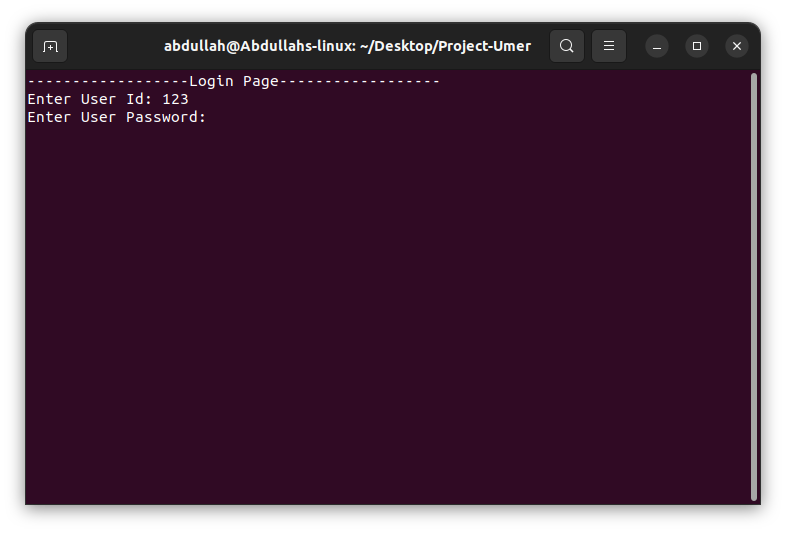
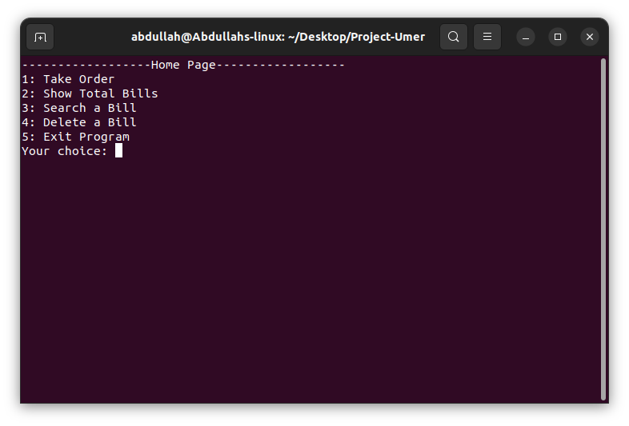
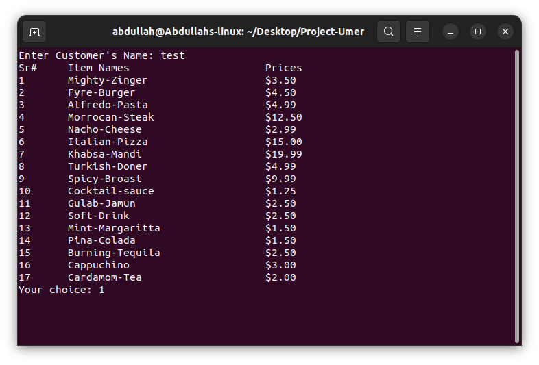
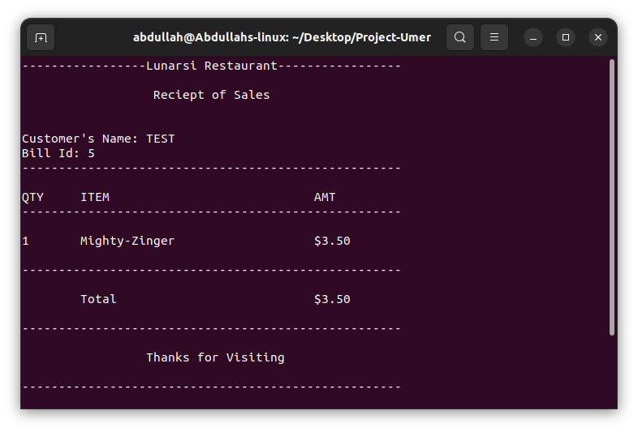
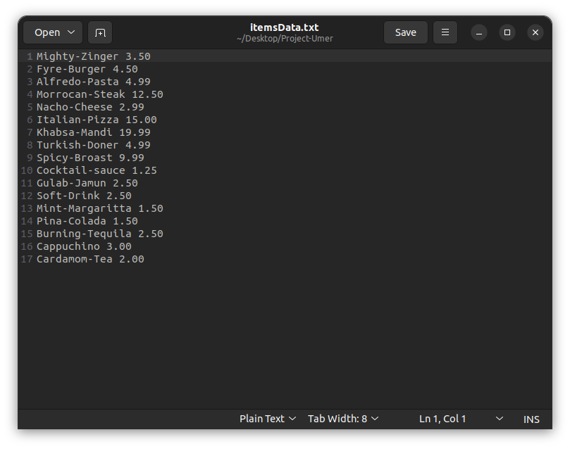
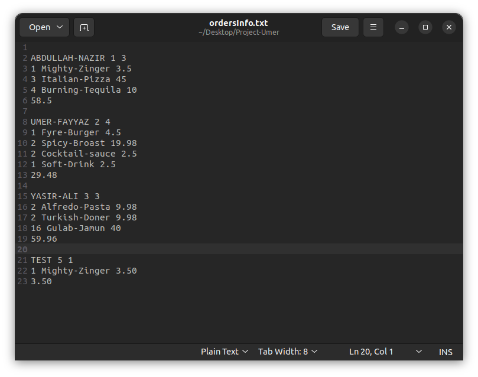
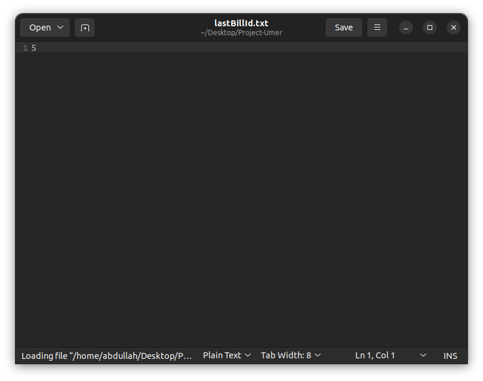

# Resturant-Order-and-Billing-Management-Project
This is a PF project writtten in c++. It covers the concepts of File Handling and Functions.
>---
## KeyPoints:
1. The main program starts with a login page, with input and credentials validation.  
2. Successful login will redirect you to the home page, where you have crud operations for order taking, showing all bill, searching and deleting a specific bill, or to exit the program.   
3. The first crud operation will display menu after reading it from the file itemsData.txt, which have menu stored in it and ask for order. On completion the reciept will be printed, and the order will be stored in the file ordersInfo.txt .  
4. The show bill will read and display all bills from the file ordersInfo.txt .
5. The search bill will ask for bill id, and search bill with the entered id in ordersInfo.txt file. If found, it will print the reciept, else it will display bill not found.
6. The delete bill will ask for bill id, and delete entered bill from ordersInfo.txt file by creating a new temp.txt file and storing all other bills in that file and atlast deleting ordersInfo.txt file and renaming temp.txt to ordersInfo.txt .
7. The project has input validations for each and every input.
8. The reciepts are also printed very neatly using formatters from iomanip header.
9. The bill id will be unique for every order. The last id will be stored in a file lastBillId.txt and will be incremented and saved for every order.
10. The delete operation will not change the counting of bill id.
>---
## Sample Outputs and Files:
- Login Page  

- Home Page  

- Menu  

- Receipt  

- Items Data(menu) file  

- Orders Data file  

- Last Bill Id file  

>---
## Running the Program
To run this program, you can download the main.cpp and .txt files in a directory. And open that directory in the terminal.   
You need to have a compiler installed like mingw, etc.  
For mingw, open the directory in the terminal and compile and run the program by:  
`g++ main.cpp -o main`  
This will compile the cpp file in an executable file main. Now, to run the executable file  
`./main.out` for unix based systems   
and  
`./main` for windows or mac.  
> Note that this program is written according to unix based system like ubuntu or mac, if you want to run it in windows you have to change every system("clear") to system("cls").
